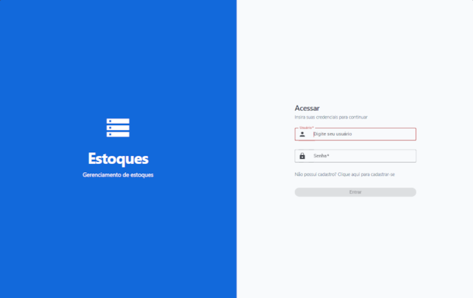
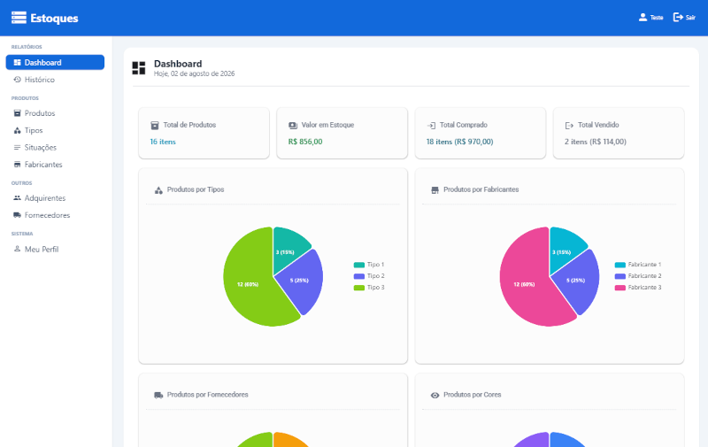
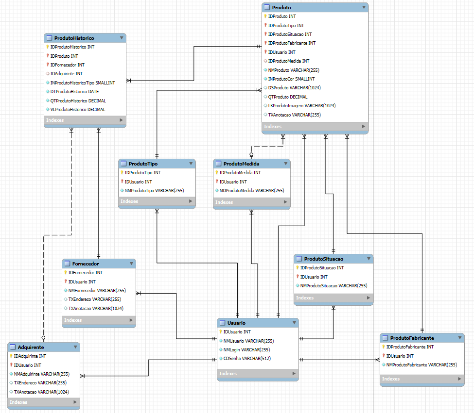

# Estoques

## Sistema de registro e acompanhamento de estoques

Uma aplicação web descentralizada e de alta performance desenvolvida para o gerenciamento de estoques e acompanhamento histórico de produtos por meio de painéis analíticos interativos. O projeto foi construído com o objetivo de demonstrar competências avançadas em arquitetura de software, desacoplamento de sistemas, boas práticas de API REST em **.NET 10** e desenvolvimento reativo no frontend com **Angular 22** e Signals. **Projeto estritamente acadêmico e de portfólio técnico**.

<p>
    
    
</p>

## Características

- Histórico de Movimentação de Produtos: tabelas interativas para acompanhamento e registro completo de entradas (compras) e saídas (vendas).

- Gerenciamento de Produtos: módulo de controle cadastral completo de produtos, incluindo suporte ao cadastro e gestão de imagens dos produtos.

- Padrão RESTful: conformidade com o modelo de maturidade REST, priorizando parâmetros de rota semânticos em vez de *query strings* desnecessárias, além de documentação e mapeamento automático de schemas via OpenAPI.

- Arquitetura Desacoplada & Clean Architecture: modelagem inspirada nos princípios de Domain-Driven Design (DDD) e Clean Architecture, garantindo o isolamento da camada de domínio/negócio em relação a frameworks e ao ORM (Entity Framework Core).

- Blindagem & Segurança Server-Side: proteção ativa contra vulnerabilidades como BOLA (Broken Object Level Authorization), garantindo que o identificador do usuário seja extraído e validado diretamente do token JWT no servidor, em vez de confiar no chamado enviado no corpo da requisição.

- Multi-usuário: sistema projetado para suporte a múltiplos usuários, garantindo o isolamento total de dados e recursos por conta.

## Arquitetura

O projeto foi estruturado seguindo os princípios do DDD (Domain-Driven Design) e da Clean Architecture, garantindo total desacoplamento, testabilidade e isolamento das regras de negócio. A solução é dividida em 4 camadas estruturais no backend:

- Estoques.Domain (coração do sistema): contém as entidades de domínio, enums e as interfaces (contratos) dos repositórios. Camada pura, sem dependências de frameworks externos ou ORMs.

- Estoques.Infra.Data (infraestrutura): implementação do repositório, configuração do DbContext do Entity Framework Core e mapeamentos relacionais. É a única camada que conhece os detalhes de acesso ao banco de dados.

- Estoques.Service (regras de negócio): contém os serviços de aplicação que orquestram os fluxos de dados, validações internas e lógica de cálculos utilizados na aplicação.

- Estoques.API (API REST): interface do usuário desenvolvida em ASP.NET Core 10, contendo as Controllers, endpoints, injeção de dependência e módulos de autenticação por tokens criptografados utilizando biblioteca JWT.

No frontend, a aplicação adota uma arquitetura reativa moderna e modular baseada em componentes standalone:

- Gerenciamento de estado reativo com Signals: utilização nativa de Signals para controle fino de estado reativo na UI, eliminando gargalos de renderização e vazamentos de memória sem a necessidade do RxJS para estados locais.

- Visualização de dados interativa: integração com Apache ECharts para renderização de gráficos de dinâmicos e layout responsivo.

- Tailwind CSS + Angular Material: interface limpa, acessível e responsiva desenvolvida com Tailwind CSS e componentes do Angular Material (`MatCard`, `MatProgressBar`, `MatIcon` etc).

- Arquitetura de Serviços & Utilitários: separação clara entre serviços HTTP para consumo da API e funções utilitárias isoladas para montagem dinâmica dos gráficos.

- Arquitetura de Pastas (Core & Shared):
  
  - `core/services`: camada de serviços singleton responsável por toda a comunicação HTTP com a API REST, mantendo os componentes visuais focados exclusivamente na apresentação.
  
  - `core/guards & interceptors`: proteção de rotas via route guards e injeção transparente de cabeçalhos de autenticação JWT via HTTP Interceptors.
  
  - `pages`: módulos de páginas isolados por domínio de negócio (Dashboard, Produtos, Fabricantes, Relatórios etc).
  
  - `shared`: componentes e utilitários reutilizáveis pela aplicação.

### Modelagem do Banco de Dados (MER)

Abaixo está a estrutura relacional projetada para suportar o domínio do sistema, adotando o padrão de nomenclatura de banco de dados do **DoD (Department of Defense)** para garantir consistência, legibilidade e padronização estrita nas tabelas e atributos:

<p>
    
</p>

## Stack Tecnológica e Infraestrutura

- Banco de dados: PostgreSQL (executado via Docker). Banco relacional robusto rodando em container isolado.

- Backend: .NET 10 / C#. Framework de altíssima performance para a construção da API RESTful.

- Persistência / ORM: Entity Framework Core. Mapeamento objeto-relacional (ORM) com suporte a Migrations e consultas LINQ otimizadas.

- Segurança: autenticação stateless via tokens JWT (JSON Web Tokens) criptografados.

- Frontend: Angular 22, TypeScript, Tailwind CSS e Angular Material. Interface limpa, responsiva, com suporte a Signals para gerenciamento de estado reativo.

- Gráficos & Dashboards: Apache ECharts (`ngx-echarts`). Renderização interativa de gráficos totalmente localizados em português e com suporte a *auto-resize*.

## Boas Práticas

- Proteção contra vulnerabilidades de lado de servidor: implementação de blindagem contra ataques de BOLA (Broken Object Level Authorization) ao forçar o identificador extraído do token no servidor em vez de confiar cegamente no JSON que vem do cliente.

- Tratamento de exceções relacionais: em conformidade com o princípio de Responsabilidade Única (SRP), a camada de serviço não conhece o EF Core. O tratamento de violações de integridade de chaves estrangeiras (ex: tentar apagar uma categoria com produtos vinculados) é capturado via `DbUpdateException` diretamente dentro da `Infra.Data`, devolvendo um fluxo limpo de falha sem onerar a memória com Stack Traces globais.

- Design de API RESTful: endpoints em conformidade estrita com os métodos HTTP (GET para leitura, POST para cadastro, PUT para atualização, DELETE para remoção), priorizando parâmetros de rota semânticos em vez de *query strings* desnecessárias, além de documentação e mapeamento automático de schemas via OpenAPI.

- Agrupamentos temporais e DTOs otimizados: lógica avançada com LINQ para mapear, filtrar e consolidar dados agregados no backend, garantindo respostas leves ao frontend em requisições únicas.

- Injeção funcional de HTTP Interceptors no Angular: utilização das novas APIs funcionais do Angular (`withInterceptors`) para anexar automaticamente o cabeçalho `Authorization: Bearer <token>` em todas as requisições enviadas ao backend, centralizando a segurança da camada de rede sem duplicar código nos serviços.

- Gerenciamento de estado reativo com Signals: substituição de subscrições manuais ao RxJS pelo uso nativo de Signals eliminando riscos de vazamento de memória e otimizando o ciclo de detecção de mudanças no DOM.

- Desacoplamento e reutilização com utilitários de UI: isolamento da lógica de configuração gráfica do ECharts em utilitários TypeScript puros, mantendo os componentes Angular extremamente enxutos e focados apenas na renderização da tela.

## Como executar o projeto com Docker e .NET

Certifique-se de ter o Docker, o .NET 10 SDK e o Node.js 26 instalados em sua máquina local.

1 - Requisitos:

- .NET 10 SDK
- Docker & Docker Compose
- EF Core CLI (dotnet ef instalado)
- Node.js 26

2 - Renomeie os arquivos .env.exemplo e Estoques.API/appsettings.json.exemplo removendo o sufixo .exemplo. Em seguida, insira sua própria senha para o banco de dados PostgreSQL.

3 - Na pasta Backend (onde está o arquivo docker-compose-postgre.yml), execute o comando:

```bash
docker compose -f docker-compose-postgre.yml up -d
```

4 - Certifique-se de que o arquivo appsettings.json do Estoques.API aponta para o endereço do banco local (localhost:5433) com as credenciais configuradas no container. Ajuste também a chave secreta (256 bits) que será utilizada no JWT.

5 - Rodar as Migrations 

Navegue até a pasta Backend e execute os comandos:

```bash
dotnet restore
dotnet build
dotnet ef database update --project Estoques.Infra.Data --startup-project Estoques.API
dotnet run --project Estoques.API
```

6 - Rodar o Angular

Navegue até a pasta Frontend e execute os comandos:

```bash
npm install
npx ng serve
```

Para acessar o sistema de Estoques, entre no link local: http://localhost:4200

Para conferir os endpoints da API Rest, acesse o link local: http://localhost:5237/openapi/v1.json

## Isenção de Responsabilidade (Disclaimer)

Este é um **projeto estritamente acadêmico e de portfólio**, desenvolvido com o objetivo de demonstrar competências técnicas em Engenharia de Software, Arquitetura de Sistemas com .NET 10, Angular 22 e boas práticas de desenvolvimento web.

- **Dados fictícios:** quaisquer valores, ativos, produtos exibidos ou inseridos na aplicação são meramente ilustrativos, não correspondendo a dados reais de mercado.
- **Uso local:** o software foi desenhado para execução em ambiente de desenvolvimento local (Sandbox) e não deve ser utilizado como um sistema de estoques ou controle patrimonial real sem as devidas auditorias e adaptações de segurança de infraestrutura.
